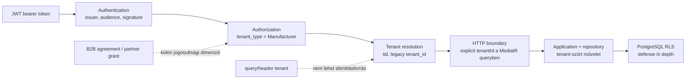

# Cutting auth- és tenant-kontraktus

- **Állapot:** implementálva a munkafában, független backend review szükséges
- **Dátum:** 2026-07-21
- **Hatókör:** SpaceOS Cutting API; újrahasznosítható minta más ERP- és iparági modulokhoz
- **Feladat:** `WORLDS-CUTTING-AUTHFIX`

## 1. Cél

Ez a dokumentum rögzíti, hogyan jut el a hitelesített tenant-identitás a HTTP
kéréstől a Cutting application boundaryig. A cél, hogy:

- a kliens ne választhasson tetszőleges tenantot queryből vagy headerből;
- az autentikáció, autorizáció, tenantfeloldás és adatbázis-izoláció külön réteg
  maradjon;
- az application handler ne függjön HTTP-környezettől;
- ugyanaz az elv alkalmazható legyen ERP-modulban, iparági modulban és
  ügyfél-instance-ben;
- a későbbi B2B-kézfogás partnerjogosultsága ne keveredjen össze a tenant
  identitásával.

Kapcsolódó döntések:

- [ADR-061 — host auth és tenant-identitás](../adr/ADR-061-host-auth-es-tenant-identitas.md)
- [ADR-062 — RLS tenant-izoláció](../adr/ADR-062-rls-tenant-izolacio.md)
- [ERP capability boundary audit](ERP_CAPABILITY_BOUNDARY_AUDIT_2026-07-18.md)
- [B2B handshake architektúra](SPACEOS_B2B_HANDSHAKE_ARCHITECTURE_2026-07-21.md)

## 2. Mi volt a hiba?

Az analytics endpointok publikus `tenantId` query-paramétert fogadtak. Emiatt két
probléma állt fenn:

1. a portál query-paraméter nélkül `400 Bad Request` választ kapott;
2. egy hitelesített hívó elvileg másik tenant azonosítóját is elküldhette.

A pricing-rules route-csoport közben nem kért autorizációt, a
`ManufacturerOnly` policy pedig csak bejelentkezést ellenőrzött, nem a
Manufacturer tenanttípust.

Ez nem pusztán UI/API drift: tenant-hamisítási és jogosulatlan hozzáférési
kockázat.

## 3. Kötelező réteghatárok



| Réteg | Felelősség | Amit nem tehet |
|---|---|---|
| Authentication | JWT aláírás, issuer és audience ellenőrzése | Nem dönthet domainjogosultságról |
| Authorization | `tenant_type=Manufacturer` vagy más capability policy | Nem fogadhat el tenantot request inputból |
| Tenant resolution | Hitelesített claimből `Guid` tenant azonosító | Nem kérdezhet adatbázist és nem végezhet domainműveletet |
| HTTP boundary | A feloldott tenant explicit átadása a command/query felé | Nem rejtheti a tenantot statikus/globális állapotba |
| Application | Explicit tenanttal végrehajtott use case | Nem olvashat `HttpContext`-et |
| Persistence/RLS | Második tenant-izolációs védelmi vonal | Nem javíthat ki hamis identitásforrást |

Az auth és az RLS együtt szükséges. Ha az RLS hamisított tenantot kap, önmagában
nem véd; ha csak az API szűr, az adatbázisban nincs defense in depth.

## 4. Claim-kontraktus

### 4.1 Tenant azonosító

| Prioritás | Claim | Szabály |
|---:|---|---|
| 1 | `tid` | Canonical SpaceOS tenant claim |
| 2 | `tenant_id` | Átmeneti legacy fallback, csak ha `tid` nincs jelen |
| — | `tenantId` query / `X-Tenant-Id` header | Nem hitelesített identitásforrás, ezért figyelmen kívül hagyandó vagy elutasítandó |

Fail-closed szabályok:

- érvényes `tid` → ezt kell használni;
- hiányzó `tid`, érvényes `tenant_id` → legacy kompatibilitásként használható;
- jelen lévő, de hibás `tid` → `Guid.Empty`, nincs legacy fallback;
- mindkét claim hiányzik vagy hibás → `401 Unauthorized`;
- ha a két claim eltér → a `tid` az irányadó.

A JWT konfigurációban a `MapInboundClaims = false` kötelező, különben a claim
neve platformfüggően átíródhat.

### 4.2 Manufacturer policy

A `ManufacturerOnly` policy követelménye:

```text
tenant_type = Manufacturer
```

Várt HTTP-viselkedés:

| Kérés | Eredmény |
|---|---:|
| Nincs hiteles token | 401 |
| Hiteles token, de nincs megfelelő `tenant_type` | 403 |
| `tenant_type=Manufacturer`, érvényes tenant claim | endpoint üzleti eredménye |
| Manufacturer claim megvan, tenant claim hiányzik az analytics kérésnél | 401 |

A role és a tenanttípus nem ugyanaz a fogalom. Ha Keycloak később role-t is
ad, a policy akkor is név szerint deklarálja, melyik claim a szerződés része.

## 5. Cutting API-kontraktus

Az alábbi analytics endpointok tenantja kizárólag az
`ICuttingTenantAccessor` értékéből származhat:

| Metódus | Route |
|---|---|
| GET | `/api/cutting/analytics/execution-metrics` |
| GET | `/api/cutting/analytics/material-usage` |
| GET | `/api/cutting/analytics/oee` |
| GET | `/api/cutting/analytics/operator-metrics` |
| GET | `/api/cutting/analytics/rebuild-status?jobId=...` |
| POST | `/api/cutting/analytics/rebuild` |
| GET | `/api/cutting/analytics/dashboard-summary` |

A régi kliens által küldött `tenantId` query a Minimal API számára ismeretlen
input marad és nem írhatja felül a claimet. Ez kompatibilis átmenet: a kliens
eltávolíthatja a queryt saját ütemében, de a szerver már nem bízik benne.

A teljes `/api/pricing-rules` csoport `ManufacturerOnly` védelem alatt áll:

- `POST /api/pricing-rules/`
- `GET /api/pricing-rules/{id}`
- `PUT /api/pricing-rules/{id}/activate`
- `POST /api/pricing-rules/{id}/calculate-price`

## 6. Kódfelelősségek

| Fájl | Felelősség |
|---|---|
| `Api/Program.cs` | JWT és `ManufacturerOnly` policy |
| `Infrastructure/Adapters/HttpContextCuttingTenantAccessor.cs` | `tid`/legacy claim feloldása, fail-closed viselkedés |
| `Api/Endpoints/AnalyticsEndpoints.cs` | request-scoped tenant átadása a MediatR queryknek |
| `Api/Endpoints/PricingRuleEndpoints.cs` | route-szintű autorizáció |
| Application query/handler | explicit `Guid tenantId`; HTTP-független use case |
| Repository + RLS | tenant-szűrés és adatbázis-szintű izoláció |

Tilos:

- `HttpContext` olvasása handlerből vagy domainből;
- tenant query/header megbízható identitásként kezelése;
- JWT vagy teljes claimlista logolása;
- `Guid.Empty` tenanttal repository művelet indítása;
- egy partner `agreementId`-ját tenantként használni.

## 7. B2B-kézfogás kapcsolódása

A B2B kézfogás három külön azonosítót használhat, ezek nem cserélhetők fel:

| Azonosító | Jelentés |
|---|---|
| `tenantId` | Melyik SpaceOS szervezet nevében fut a kérés |
| `partnerTenantId` | Melyik másik szervezet a szerződés résztvevője |
| `agreementId` / `workPackageId` | Melyik digitális megállapodás vagy kiadott feladat ad hozzáférést |

Külső partner hozzáférésénél előbb a saját hitelesített tenantot kell
feloldani, majd külön participant/capability ellenőrzéssel kell bizonyítani,
hogy az adott megállapodáshoz hozzáférhet. A kézfogás nem ad általános jogot a
partner teljes tenant-adatállományához.

## 8. Újrahasznosítás ERP-n kívül

Ez a minta platform-infrastruktúra, nem ERP domainlogika. Emiatt a Cutting,
Joinery, Inventory, Procurement és későbbi Door/Cabinet/Window modulok is
alkalmazhatják anélkül, hogy ERP-csomagot importálnának.

Hosszú távú csomaghatár:

```text
SpaceOS identity/hosting contract
    ├── JWT + claim mapping
    ├── tenant accessor
    ├── policy helpers
    └── persistence tenant session

ERP modules                  Industry modules              Instance packs
CRM/HR/QA/...                Cutting/Joinery/...           Doorstar adapters/UI
```

Az instance pack saját arculatot, route-okat, konfigurációt és modulválasztást
adhat, de az identitási szerződést nem írhatja felül. Így az adott platform a
saját képére formálható, miközben SpaceOS-kompatibilis marad.

## 9. Agent végrehajtási és review kapu

Implementáló agent:

1. olvassa el ADR-061/062-t és a modul saját `CLAUDE.md`/`AGENTS.md` fájlját;
2. foglaljon diszjunkt taskot az `EPICS.yaml` fájlban;
3. előbb készítsen negatív tesztet a tenant-felülírásra és a 401/403 mátrixra;
4. csak a HTTP boundaryn olvasson claimet;
5. futtassa a célzott és teljes tesztkaput;
6. rögzítse a baseline hibákat, ne nevezze őket automatikusan regressziónak;
7. ne deployoljon review nélkül.

Reviewer:

- [ ] `tid` elsődleges, legacy fallback csak hiány esetén;
- [ ] hibás `tid` fail-closed;
- [ ] query/header nem írhat felül claimet;
- [ ] `ManufacturerOnly` valódi claimet követel;
- [ ] 401/403/200 mátrix tesztelt;
- [ ] handler HTTP-független;
- [ ] repository/RLS tenant-szűrése változatlanul megmarad;
- [ ] token, claimlista és tenantlista nem kerül logba;
- [ ] kompatibilitási hatás dokumentált;
- [ ] maker és reviewer külön személy/agent.

## 10. Jelenlegi bizonyíték és nyitott kapu

2026-07-21-i munkafa:

- célzott security tesztek: **41/41 zöld**;
- Cutting solution clean build: **0 warning, 0 hiba**; MailKit 4.16.0 után a
  runtime projektek vulnerability auditja tiszta;
- teljes suite az authfix után: **1021/1047 zöld**; a kapcsolódó
  TenantResolver scalar-query javítás után **1028/1047 zöld**, az invariáns
  pricing/OptiCut javítás és három új teszt után **1036/1050 zöld**, majd a
  hordozható subprocess fixture után **1041/1050 zöld**, végül az email boundary
  után **1043/1050 zöld**, a canonical quote tenant/harness javítás és három új
  security teszt után pedig **1053/1053 zöld, 0 hiba**, majd az internal secret,
  adapter traversal és SignalR claim boundary 16 új regressziója után
  **1069/1069 zöld, 0 hiba**;
- az authfix `a889109` Cutting commitban és `ff1ff3e` platform-pinben review
  PASS eredménnyel rögzítve; deploy nem történt;
- következő lépés: a resolver, kultúrafüggetlenítési, subprocess portability,
  email boundary, quote tenant-harness és security-hardening diff független
  Claude/backend review-ja, az internal caller secret rollout bizonyítása,
  majd külön Cutting commit és platform-pin.

A részletes futtatási és hibatriázs útmutató:
[Cutting fejlesztési és tesztelési runbook](../engineering/CUTTING_DEVELOPMENT_TEST_RUNBOOK.md).
