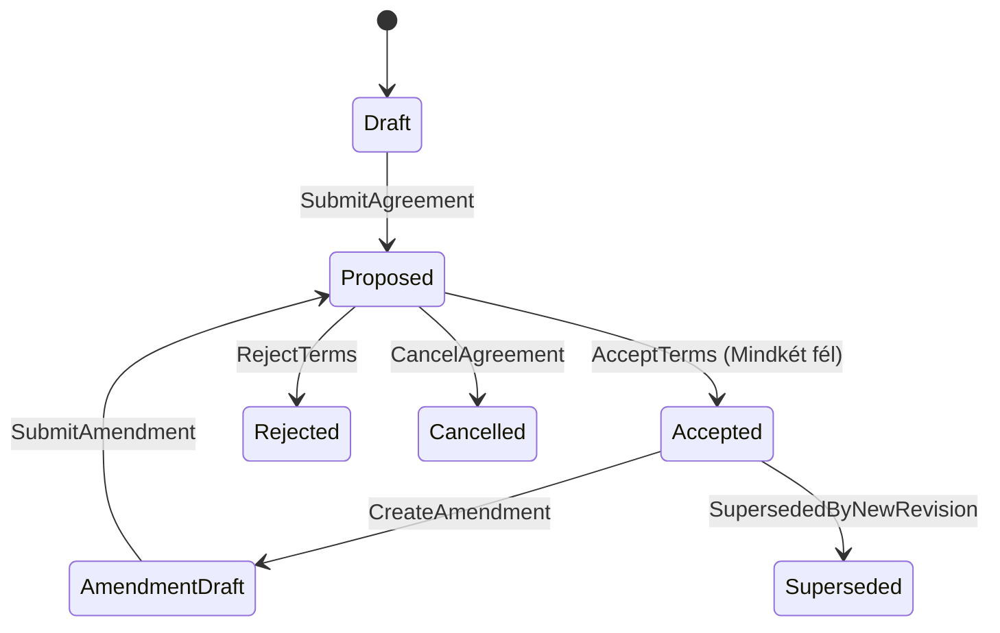
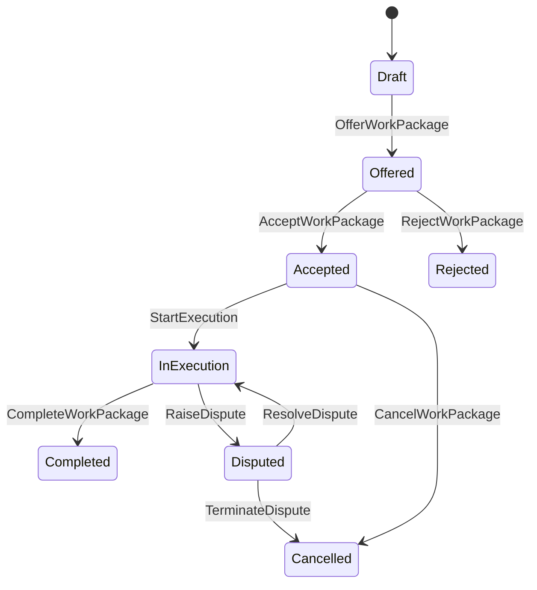

# B2B Collaboration Domain Contract — SpaceOS B2B Protocol

- **Bounded Context:** `SpaceOS.Collaboration` / `spaceos-collaboration`
- **Verzió:** `v1.0.0`
- **Státusz:** Normatív Szerződés (ADR-068 Elfogadva, 2026-07-27)
- **Típus:** Iparág-semleges platform-szerződés
- **Források:** [ADR-068](../../adr/ADR-068-project-core-and-b2b-collaboration-ownership.md), [B2B Architektúra](../architecture/SPACEOS_B2B_HANDSHAKE_ARCHITECTURE_2026-07-21.md), [ADR-066](../../adr/ADR-066-erp-module-contract-boundaries.md)

---

## 1. Architekturális Helyzet & Source of Truth Mátrix

A B2B Collaboration egy önálló, iparágsemleges Bounded Context. Kizárólagos tulajdonosa a vállalatközi megállapodásoknak és a delegált feladatcsomagoknak.

| Koncepció / Entitás | Canonical Source of Truth | Felelősség & Hatáskör | Elavult / Retire-jelölt Korábbi Típusok |
|---------------------|---------------------------|----------------------|-----------------------------------------|
| **Vállalatközi Megállapodás** | `CollaborationAgreement` aggregate (`SpaceOS.Collaboration`) | Bilateriális üzleti/szállítási feltételek, verziózott feltételek, elfogadási bizonyíték | Kernel `B2BHandshake` VO (`FlowEpic.Handshake`) |
| **Résztvevői Jogosultság** | `CollaborationParticipantGrant` (`SpaceOS.Collaboration`) | Host, Guest, engedélyezett capability-k és terms-verzió RLS-bizonyítéka | `TenantHandshakeAllowlist` közvetlen RLS-ként való használata (az Allowlist csak directory szűrő marad) |
| **Delegált Feladatcsomag** | `DelegatedWorkPackage` aggregate (`SpaceOS.Collaboration`) | Delegált feladat állapota, mérföldkövei, átadási bizonyítékok és lezárás | CRM `Opportunity.DelegateToPartner` (holt kód), Procurement direct `SubcontractOrder` FSM duplikáció |
| **Feltétel-verzió & Hash** | `AgreementTermsRevision` (`SpaceOS.Collaboration`) | Immutábilis SHA-256 szerződéshash, elfogadási auditnapló | Plaintext JSON string mezők (`InitiatorAnchorJson`) |
| **Üzenetküldés & Idempotencia** | `CollaborationOutbox` / `CollaborationInbox` (`SpaceOS.Collaboration`) | Garanciális vállalatközi eseménykézbesítés, átviteli elkülönítés | Kernel közös Outbox / szinkron HTTP REST hívások |

---

## 2. Azonosítók, Semleges Referenciák és Value Objectek

### 2.1 Erősen Típusos Azonosítók (Strongly Typed IDs)
- `AgreementId`: Guid — Vállalatközi megállapodás egyedi azonosítója.
- `WorkPackageId`: Guid — Delegált feladatcsomag egyedi azonosítója.
- `TermsRevisionId`: Guid — Szerződési feltételverzió azonosítója.
- `ParticipantGrantId`: Guid — B2B jogosultsági bejegyzés azonosítója.

### 2.2 Semleges Referenciák (ADR-066 Szerint)
- `HostTenantId`: Guid — Feltételeket kínáló / kiszolgáló tenant azonosítója.
- `GuestTenantId`: Guid — Munkát delegáló / igénybe vevő tenant azonosítója.
- `ProjectRef`: `ProjectRef` struct (`FlowEpicId` Guid) — Kapcsolódó projekt-orchestration hivatkozás.
- `OrderRef`: `OrderRef` struct (`OrderId` Guid) — Kapcsolódó megrendelés hivatkozás (CRM/Procurement).
- `PartyRef`: `PartyRef` struct (`TenantId` Guid) — Üzleti partner identitása.

### 2.3 Value Objectek
- `TermsHash`: `string` (64 karakteres hex SHA-256 string) — Szerződési szöveg és struktúra csonkíthatatlan lenyomata.
- `AcceptanceEvidence`: `(Guid ActorId, string ActorRole, DateTimeOffset AcceptedAtAtUtc, string IpAddress, string ClientUserAgent)` — Jogi/auditálható elfogadási bizonyíték.
- `CapabilityScope`: `string` — Iparág-semleges capability azonosító (pl. `"procurement.subcontract"`, `"production.cutting"`, `"qa.inspection"`).

---

## 3. Állapotgépek (FSM) és Tranzíciós Mátrixok

### 3.1 `CollaborationAgreement` Lifecycle FSM

| Forrás Állapot | Cél Állapot | Parancs / Esemény | Actor Guard | Üzleti Guard / Invariáns | Audit & Esemény |
|----------------|-------------|-------------------|-------------|--------------------------|-----------------|
| `Draft` | `Proposed` | `ProposeAgreementCommand` | Host vagy Guest Admin | TermsHash nem üres, ParticipantGrant érvényes az Allowlistben | `AgreementProposedEvent` |
| `Proposed` | `Accepted` | `AcceptAgreementCommand` | Ellenoldali Tenant Admin | Mindkét fél explicit elfogadási bizonyítékkal rendelkezik az adott TermsRevisionId-ra | `AgreementAcceptedEvent`, AuditLog entry |
| `Proposed` | `Rejected` | `RejectAgreementCommand` | Ellenoldali Tenant Admin | Indoklás megadva (min. 10 karakter) | `AgreementRejectedEvent` |
| `Proposed` | `Cancelled` | `CancelAgreementCommand` | Kezdeményező Tenant Admin | Még nem került elfogadásra | `AgreementCancelledEvent` |
| `Accepted` | `AmendmentDraft` | `DraftAmendmentCommand` | Bármelyik Szerződő Tenant | Meglévő elfogadott megállapodás módosítása új verziószámmal | `AgreementAmendmentDraftedEvent` |
| `Accepted` | `Superseded` | `SupersedeAgreementCommand` | Rendszer / Admin | Új `AgreementTermsRevision` `Accepted` állapotba lépett | `AgreementSupersededEvent` |

### 3.2 `DelegatedWorkPackage` Lifecycle FSM

| Forrás Állapot | Cél Állapot | Parancs / Esemény | Actor Guard | Üzleti Guard / Invariáns | Audit & Esemény |
|----------------|-------------|-------------------|-------------|--------------------------|-----------------|
| `Draft` | `Offered` | `OfferWorkPackageCommand` | Host Tenant Dispatcher | Létező, `Accepted` állapotú `CollaborationAgreement` és aktív `ParticipantGrant` | `WorkPackageOfferedEvent` |
| `Offered` | `Accepted` | `AcceptWorkPackageCommand` | Guest Tenant Operator | Kapacitás és feltételek igazolva | `WorkPackageAcceptedEvent` |
| `Offered` | `Rejected` | `RejectWorkPackageCommand` | Guest Tenant Operator | Elutasítási indok rögzítve | `WorkPackageRejectedEvent` |
| `Accepted` | `InExecution` | `StartWorkPackageExecutionCommand` | Guest Tenant Worker/System | Munkakezdési feltételek teljesültek | `WorkPackageExecutionStartedEvent` |
| `InExecution` | `Completed` | `CompleteWorkPackageCommand` | Guest Tenant Worker/QA | Műszaki átadás-átvételi bizonyíték (Inspection/QA snapshot) csatolva | `WorkPackageCompletedEvent` |
| `InExecution` | `Disputed` | `RaiseWorkPackageDisputeCommand` | Bármelyik Fél Operator | Reklamáció/minőségi kifogás részletezve | `WorkPackageDisputedEvent` |
| `Disputed` | `InExecution` | `ResolveWorkPackageDisputeCommand` | Bármelyik Fél Admin | Korrekciós intézkedés (CAPA/Credit) elfogadva | `WorkPackageDisputeResolvedEvent` |
| `Disputed` | `Cancelled` | `TerminateWorkPackageCommand` | Mindkét Fél Admin | Szerződésbontás / irreverzibilis hiba | `WorkPackageCancelledEvent` |

---

## 4. Invariánsok és Hibakód Katalogus

### 4.1 Invariánsok
1. **No Self-Delegation**: A `HostTenantId` és `GuestTenantId` soha nem lehet azonos.
2. **Directory Pre-requisite**: `CollaborationParticipantGrant` kizárólag olyan tenant-párra hozható létre, amely szerepel a `TenantHandshakeAllowlist`-ben.
3. **Immutable Acceptance**: Elfogadott `AgreementTermsRevision` tartalma és `TermsHash`-e nem módosítható. Módosítás kizárólag új `RevisionNumber`-rel rendelkező `Draft` revízióként hozható létre.
4. **Isolated Execution**: Munkacsomag (`DelegatedWorkPackage`) nem léphet `InExecution` állapotba érvényes, aktív `CollaborationAgreement` nélkül.
5. **Fail-Closed Authorization**: Ha a kérést küldő JWT claim-ben lévő Tenant ID nem egyezik sem a `HostTenantId`-val, sem a `GuestTenantId`-val, a rendszer RLS és alkalmazásszinten is 404 Not Found (vagy 403 Forbidden) választ ad.

### 4.2 Hibakód Katalogus

| Hibakód | HTTP Status | Leírás / Kiváltó Ok |
|---------|-------------|---------------------|
| `B2B_SELF_LINK_FORBIDDEN` | 400 Bad Request | A host és guest tenant azonos. |
| `B2B_ALLOWLIST_MISSING` | 403 Forbidden | A tenant-pár nem szerepel a `TenantHandshakeAllowlist` directory-ban. |
| `B2B_AGREEMENT_NOT_ACCEPTED` | 409 Conflict | Munkacsomag ajánlása nem elfogadott megállapodás mellett. |
| `B2B_TERMS_HASH_MISMATCH` | 422 Unprocessable | Az elfogadott szerződéshash nem egyezik a benyújtott feltételekkel. |
| `B2B_INVALID_STATE_TRANSITION` | 409 Conflict | Érvénytelen FSM állapotátmeneti kísérlet. |
| `B2B_TENANT_ACCESS_DENIED` | 404 Not Found | A kérelmező tenant nem részese a megállapodásnak (RLS fail-closed). |
| `B2B_REVISION_IMMUTABLE` | 409 Conflict | Kísérlet egy már elfogadott revízió közvetlen módosítására. |

---

## 5. Lifecyle Migrációs Mapping a Meglévő Típusokból

| Régi / Legacy Típus | Új Szerződéses Elem | Migrációs / Átállási Stratégia |
|---------------------|---------------------|--------------------------------|
| `FlowEpic.DelegateTo` (Kernel) | `DelegatedWorkPackage` (`SpaceOS.Collaboration`) | Deprecated. A Kernel `FlowEpic` megtartja a helyi `FlowEpicId`-t mint `ProjectRef`-et, a delegáció a `DelegatedWorkPackage`-be költözik. |
| `SpaceOS.Modules.Abstractions.Handshake.IHandshake` | `CollaborationParticipantGrant` | Kivezetésre kerül az elavult interfész, helyét az typed `CollaborationParticipantGrant` és OpenApi read-modellek veszik át. |
| CRM `Opportunity.DelegateToPartner` | `CollaborationAgreement` + `DelegatedWorkPackage` | A CRM nem hoz létre közvetlen delegációt; CRM esemény hívja meg a `Collaboration` bounded context-et. |
| Procurement `SubcontractOrder` FSM | `DelegatedWorkPackage` FSM Adapter | A `SubcontractOrder` a `DelegatedWorkPackage` eseményeit fogyasztja (B2B-06 adapter). |

---

## 6. Csomag, Namespace és Szerződéses Határok

### 6.1 Csomagszerkezet
- `SpaceOS.Collaboration.Domain`: Entitások, Value Objectek, Domain Események, FSM Guardok.
- `SpaceOS.Collaboration.Application`: CMMD/Query Handlerek, Outbox Dispatcher.
- `SpaceOS.Collaboration.Infrastructure`: EF Core DbContext, RLS Policy-k, Postgres Migrációk.
- `SpaceOS.Collaboration.Contracts`: Publikus DTO-k, OpenAPI sémák, Integration Event-ek (NuGet csomag a fogyasztóknak).

### 6.2 Verziózási és Breaking-Change Policy
- **SemVer 2.0.0**: Minden publikus DTO és esemény-séma SemVer verziónak engedelmeskedik.
- **Additive Only Changes**: Publikus mező törlése vagy típusának megváltoztatása major verziólépést (`v2.0.0`) igényel, és legalább 1 release ciklusig megelőzi egy `[Obsolete]` jelölés.
- **Schema Hash Enforcement**: Minden `IntegrationEvent` tartalmazza a `$schemaHash` fejlécet az átviteli kompatibilitás garantálására.

---

## 7. Átadási Bizonyíték (B2B-02..09 Taskok Számára)

- **B2B-02 (Participant RLS)**: Használja a `CollaborationParticipantGrant` entitást a PostgreSQL `SECURITY DEFINER` és RLS policy-k alapelemeként.
- **B2B-03 (Agreement Evidence)**: Megvalósítja az `AgreementTermsRevision` és `AcceptanceEvidence` immutábilis tárolását és SHA-256 ellenőrzését.
- **B2B-04 (Work State Protocol)**: Implementálja a `DelegatedWorkPackage` FSM állapotgépet.
- **B2B-05..09**: Fogyasztják a `SpaceOS.Collaboration.Contracts` csomagot.

---

## F0-KORREKCIÓ (root, 2026-07-28)

A fenti §3.2 mátrix actor-oszlopa eredetileg a host/guest szerepeket FORDÍTVA
tartalmazta az ADR-068 §13 és az implementáció (DelegatedWorkPackage
EnsureActorIsHost/Guest guardjai) ellenében — a B2B_COLLABORATION_REAUDIT
2026-07-28 lelete alapján javítva: a HOST ajánl (offer), a GUEST fogad
el/utasít el és hajt végre, a review/completion-elfogadás a hosté. Ahol a
lenti szöveg még a régi szereposztást tükrözné, az ADR-068 + a kód a normatív.
