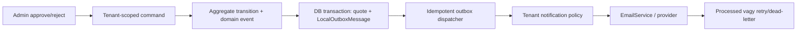

# STAB-CUTTING-QUOTE-NOTIFICATION-OUTBOX — aggregate-owned, retryzható értesítés

- **Szerep:** backend/architecture + integration
- **Prioritás:** P0
- **Státusz:** pending — a quote harness review/merge után indítható
- **Függőség:** STAB-CUTTING-QUOTE-HARNESS
- **Mutációs határ:** quote approve/reject API contract, domain event payloadok,
  local outbox dispatcher, notification handler, tenant email/url konfiguráció,
  célzott integration tesztek és migráció csak ha a meglévő outbox séma nem elég
- **Tiltott scope:** közvetlen SMTP-hívás a DB tranzakcióban, kliens által megadott
  notification recipient, best-effort csendes hiba, más modul outboxának átírása

## Kutatási eredmény

Az approve/reject endpoint jelenleg `required CustomerEmail` mezőt fogad, majd a
command sikeres mentése után közvetlenül hívja az EmailService-t. Emiatt:

1. a hitelesített admin tetszőleges recipient címet adhat meg az aggregate-ben
   tárolt `CustomerContact.Email` helyett;
2. SMTP-hiba esetén az állapot már mentve lehet, miközben a HTTP kérés hibának
   látszik — a kliens ismétlése FSM-hibát okoz;
3. nincs retry/idempotency/dead-letter operátori út;
4. az admin cím és tracking URL hard-coded/placeholder;
5. a domain már emel `QuoteApprovedEvent` és `QuoteRejectedEvent` eseményt, az
   `OutboxSaveChangesInterceptor` ezeket atomikusan `LocalOutboxMessage` sorokká
   alakítja, de quote email dispatchert a kutatás nem talált.

## Célarchitektúra

## Megvalósítási feladatok

1. Távolítsd el a `CustomerEmail` mezőt az approve/reject HTTP DTO-ból; recipient
   kizárólag az aggregate/customer snapshotból vagy az outbox eventből jöhet.
2. Bővítsd a domain eventet a kézbesítéshez szükséges stabil snapshot adatokkal
   (`TenantId`, quote number, recipient, ár/pénznem vagy reason, tracking token),
   érzékeny adatminimalizálással.
3. Készíts konfigurációvezérelt tenant notification policyt admin címhez,
   public base URL-hez, locale-hoz és enable/disable flaghez; nincs Doorstar vagy
   JoineryTech hard-code a platform adapterben.
4. Implementálj batchelt outbox dispatchert claimelt/lockolt sorokkal,
   exponential backoff + jitter retryjal, max attempt/dead-letter állapottal.
5. A kézbesítés legyen idempotens `OutboxMessage.Id`/provider idempotency key
   alapján; process crash utáni at-least-once ismétlés ne küldjön kontrollálatlan
   duplikátumot.
6. Adj structured logot és metrikát tenant ID, event ID, attempt és státusz
   mezőkkel; recipient teljes címe és payload ne kerüljön logba.
7. Dokumentáld az operátori replay/dead-letter folyamatot és a retention policyt.

## Elfogadási kritériumok

- [ ] Approve/reject API nem fogad recipient címet.
- [ ] Quote state és outbox message ugyanabban a DB tranzakcióban commitol.
- [ ] SMTP/provider kiesésnél az endpoint sikeres domain transitiont jelez, az
  outbox retryzik; nincs második FSM transition.
- [ ] Más tenant konfigurációja/recipientje nem olvasható és nem használható.
- [ ] Dispatcher duplikált feldolgozása idempotens vagy bizonyítottan deduplikált.
- [ ] Retry exhaustion dead-letter + riasztás; operátori replay auditált.
- [ ] Integration teszt bizonyít success, transient retry, permanent failure,
  restart utáni folytatás és cross-tenant izoláció esetet.

## Stop / eszkaláció

Ha a meglévő `LocalOutboxMessage` státuszmodell nem tud atomikus claimet vagy
dead-lettert, ne használj process-local lockot production garanciaként. ADR-ben
kell dönteni a séma bővítéséről és a több replika konkurenciájáról.
